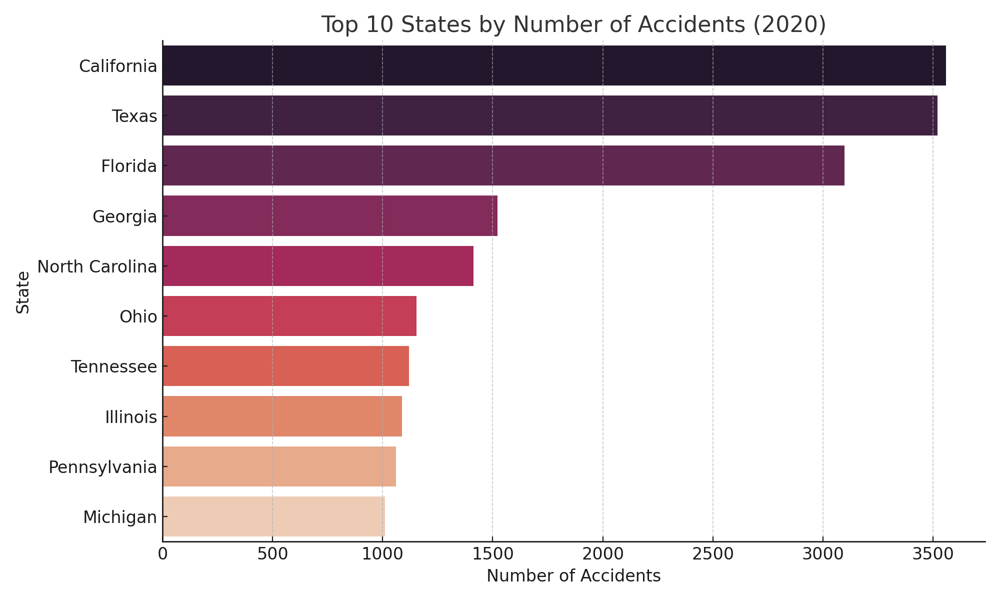
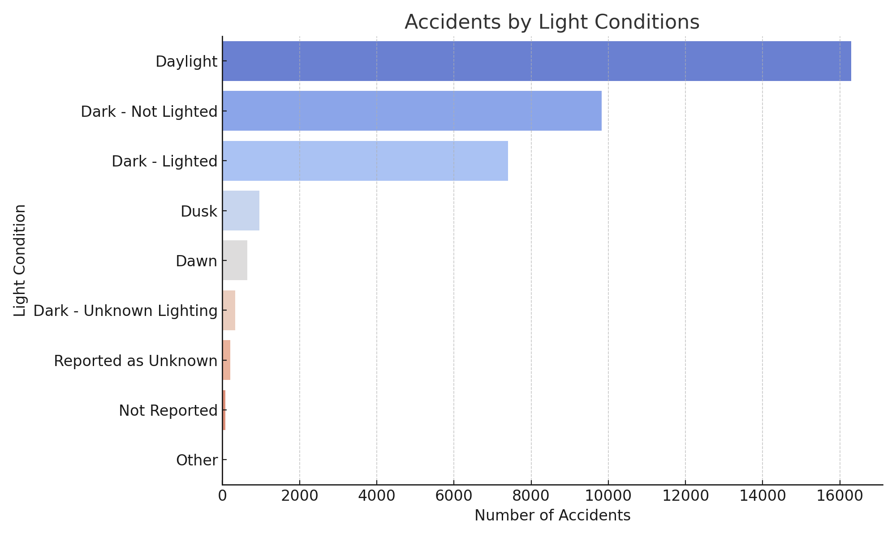
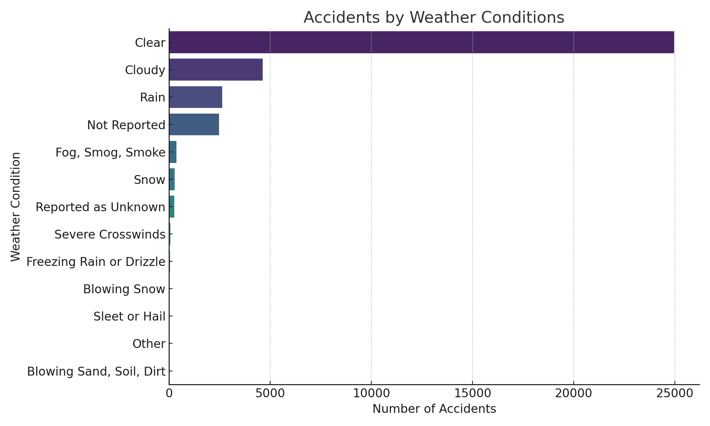
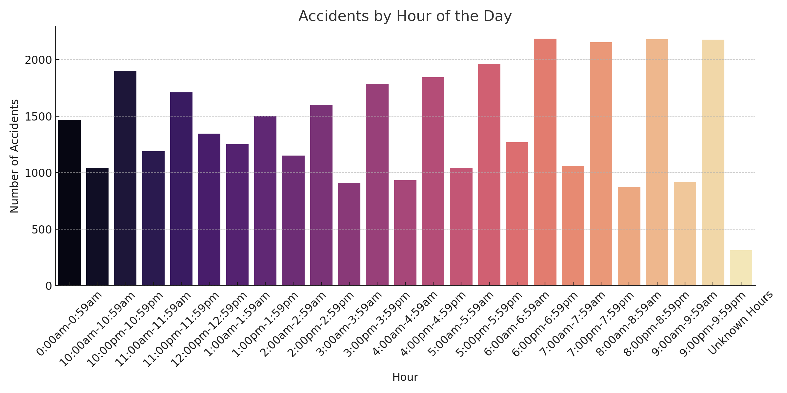

# 🚗 Road Accident Analysis - 2020 (USA)

This project analyzes 2020 U.S. traffic accident data to identify patterns based on weather, lighting, time of day, and geographic distribution.

## 📊 Key Visualizations

### 1. Top 10 States by Number of Accidents


### 2. Accidents by Light Conditions


### 3. Accidents by Weather Conditions


### 4. Accidents by Hour of the Day


---

## 🛠️ Tools Used
- Python (Pandas, Seaborn, Matplotlib)
- Jupyter Notebook
- Dataset: US DOT / Kaggle (2020 Traffic Accidents Sample)

## 📁 Project Structure
```
├── accident_eda_outputs/
│   ├── accidents_by_state.png
│   ├── light_conditions.png
│   ├── weather_conditions.png
│   └── accidents_by_hour.png
├── accident_analysis.py
├── README.md
```

## 📌 Insights
- Most accidents occurred in urbanized, high-traffic states.
- Peak accident hours align with rush hours and late nights.
- Poor light and bad weather contribute to accident spikes.

---

## ✅ How to Use
Clone or download the repo and run `accident_analysis.py` to reproduce results or build further analysis.

---
